# Easy Buy - E-Commerce Platform

Easy Buy is a modern, full-featured e-commerce platform that provides a seamless shopping experience for customers and a comprehensive management system for sellers. Built with React, TypeScript, and modern web technologies, Easy Buy offers real-time chat, product management, order tracking, and review systems.

## 📋 Table of Contents

- [Live Demo](#live-demo)
- [Brief Description](#brief-description)
- [Features](#features)
- [Application Details](#application-details)
- [Tech Stack](#tech-stack)
- [Deployment with Docker](#deployment-with-docker)
- [Running Locally](#running-locally)

## 🌐 Live Demo

Experience Easy Buy live at:

**🔗 [https://easy-buy.shirloin.my.id](https://easy-buy.shirloin.my.id)**

The live demo showcases all features of the application including:

- Product browsing and search
- Shopping cart functionality
- User authentication
- Order placement and tracking
- Real-time chat
- Review system
- Seller dashboard (requires seller account)

### Demo Accounts

_Note: Demo account credentials would typically be provided here if available._

---

## 🎯 Brief Description

Easy Buy is a comprehensive e-commerce solution that connects buyers and sellers in a user-friendly marketplace. The platform enables customers to browse products, manage their shopping cart, place orders, track shipments, communicate with sellers via real-time chat, and leave product reviews. Sellers can create shops, manage their product catalog, handle orders, and communicate with customers.

Key highlights:

- **User-Friendly Interface**: Clean, modern design built with Tailwind CSS and DaisyUI
- **Real-Time Communication**: Socket.io-powered chat system for instant messaging
- **Product Management**: Comprehensive product catalog with variants, images, and categories
- **Order Management**: Complete order lifecycle from cart to shipment
- **Review System**: Customer feedback and rating system
- **Responsive Design**: Works seamlessly on desktop and mobile devices

## ✨ Features

### Public Pages

#### 🏠 Home Page

- **Latest Products Display**: Browse the most recent products added to the platform
- **Product Grid Layout**: Responsive grid displaying product cards with images, prices, and ratings
- **Quick Navigation**: Easy access to search and product details

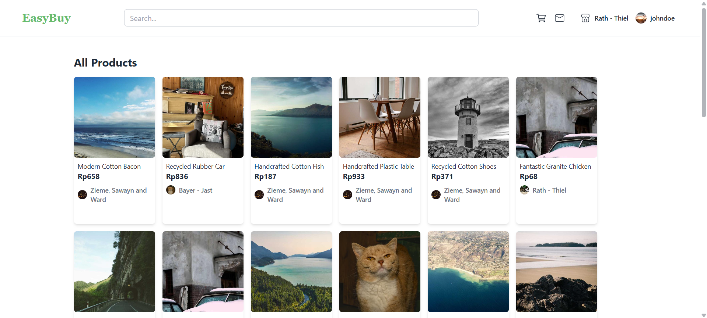

#### 📦 Product Detail Page

- **Product Images**: Multiple product images with variant selection
- **Product Information**: Detailed product description, price, and specifications
- **Product Variants**: Selection of different product variants (size, color, etc.)
- **Shop Information**: Display seller shop details and ratings
- **User Reviews**: View customer reviews and ratings for the product
- **Related Products**: Suggestions for similar products in the same category
- **Add to Cart**: Quick add to cart functionality

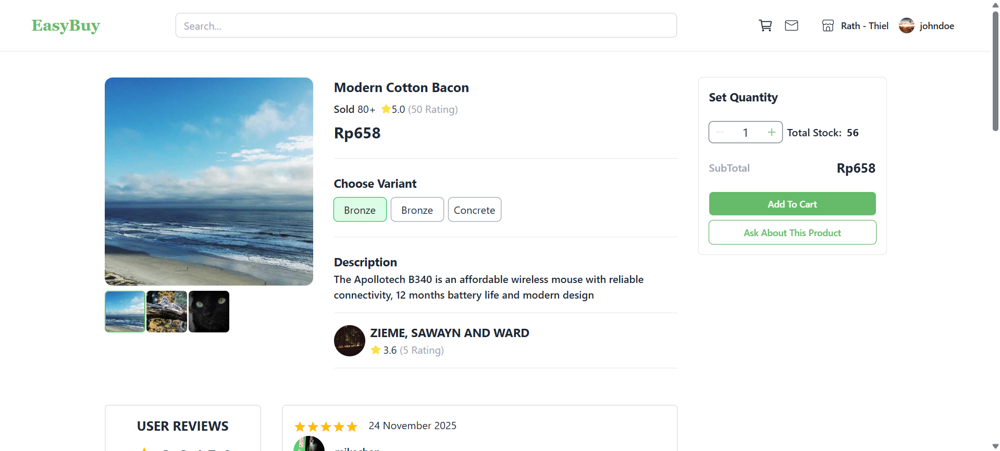

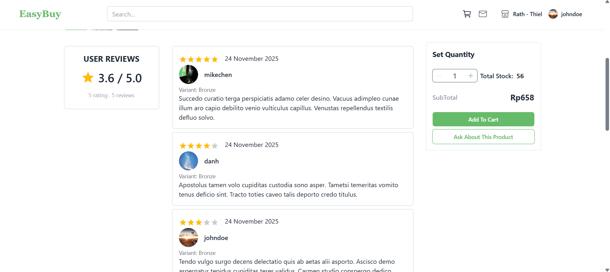

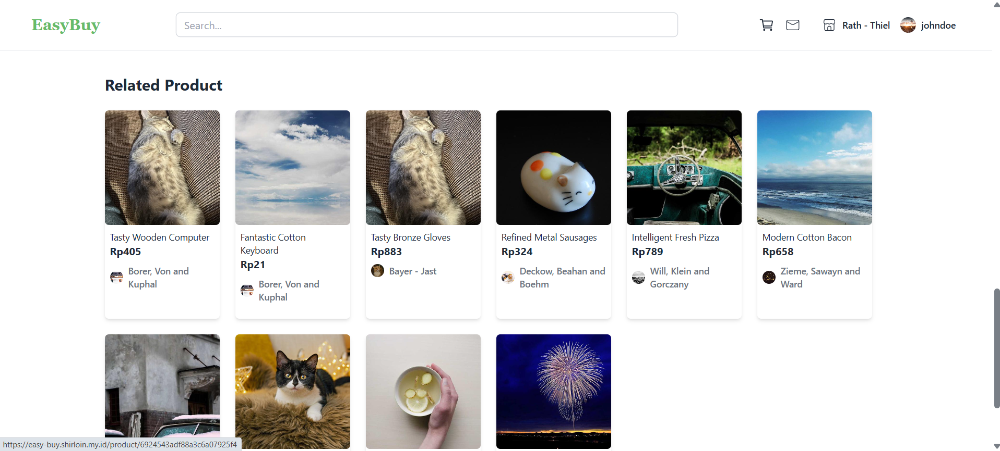

### Protected User Pages

#### 🛒 Cart Page

- **Cart Management**: View and manage all items in the shopping cart
- **Quantity Control**: Increase or decrease product quantities
- **Item Removal**: Remove items from cart
- **Price Calculation**: Automatic total price calculation
- **Checkout Preparation**: Review items before proceeding to shipment

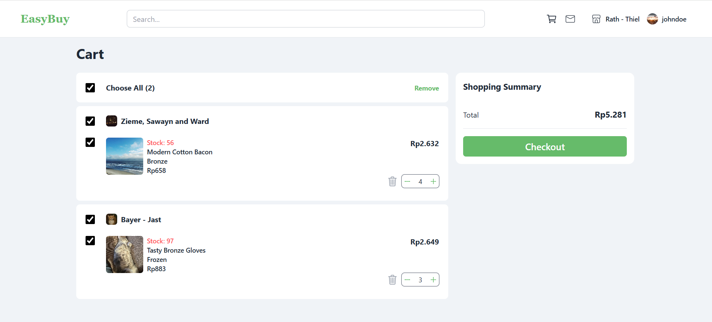

#### 📮 Shipment Page

- **Address Selection**: Choose or add shipping addresses
- **Order Summary**: Review selected items and quantities
- **Shipping Details**: Configure shipping information
- **Order Placement**: Complete the purchase process

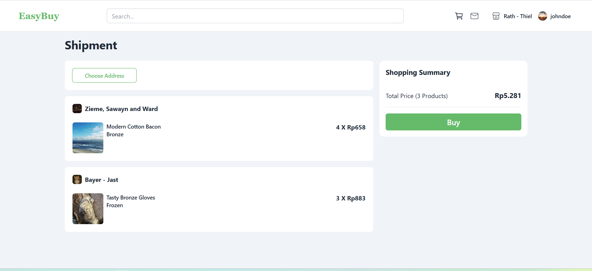

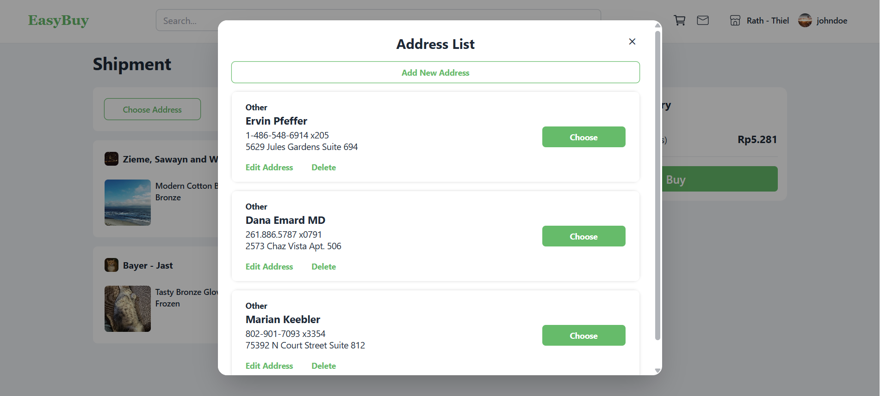

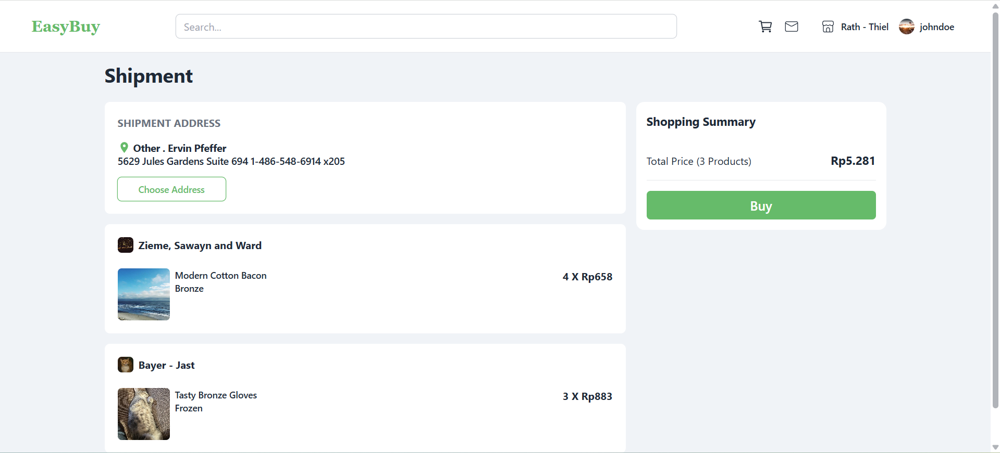

#### 💬 Chat Page (User)

- **Chat Rooms**: List of all active chat conversations
- **Real-Time Messaging**: Socket.io-powered instant messaging
- **Seller Communication**: Chat with sellers about products or orders
- **Message History**: View previous conversation history
- **Chat Interface**: Clean, modern chat UI with message bubbles

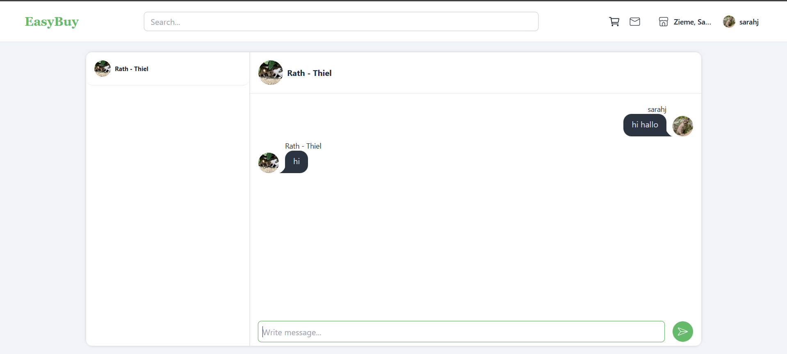

#### 👤 Profile Page

- **Biodata Section**: View and edit user profile information
- **Address Management**:
  - View saved addresses
  - Add new shipping addresses
  - Edit existing addresses
  - Delete addresses
- **Order History**: View all past and current orders
- **Order Tracking**: Track order status and details

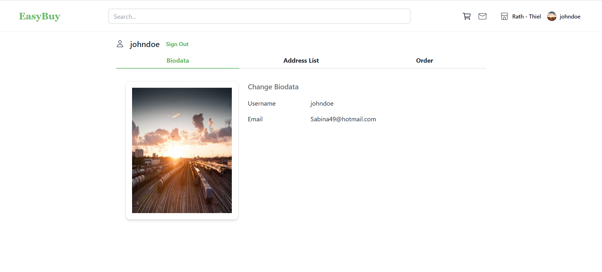

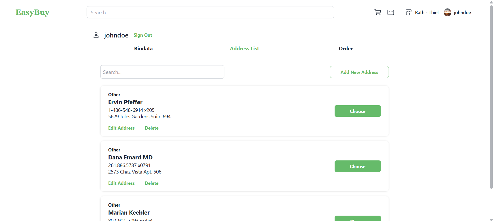

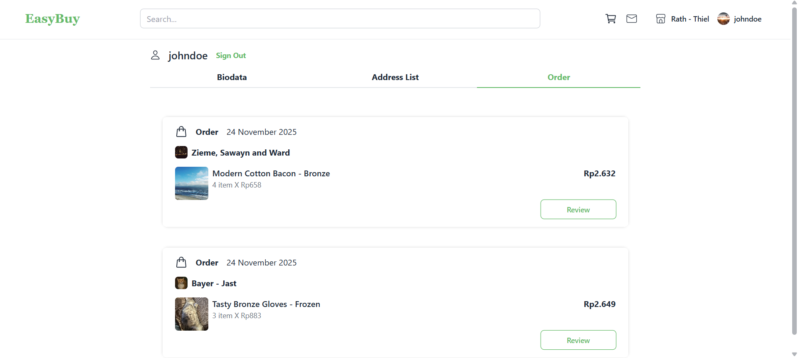

#### ⭐ Review Page

- **Waiting to Review**: List of completed orders awaiting review
- **My Reviews**: View all submitted product reviews
- **Review Submission**: Submit reviews with ratings and comments
- **Review Management**: Edit or update existing reviews

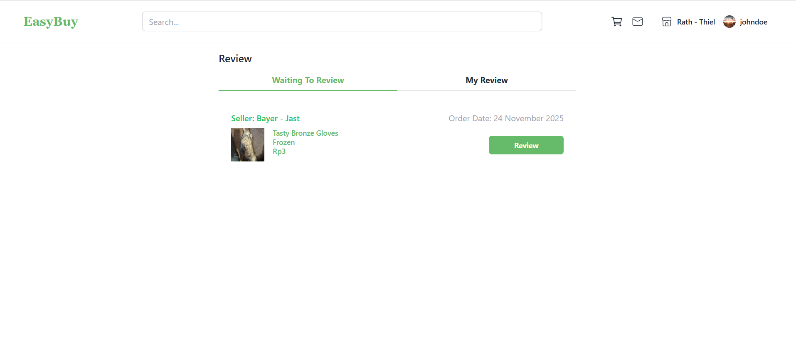

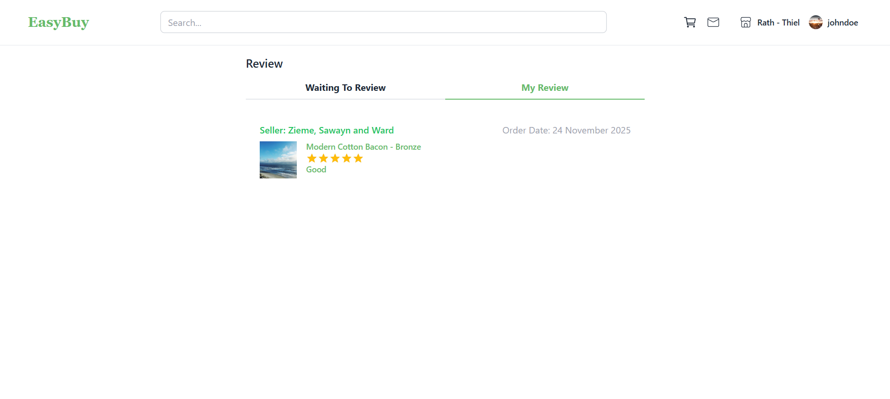

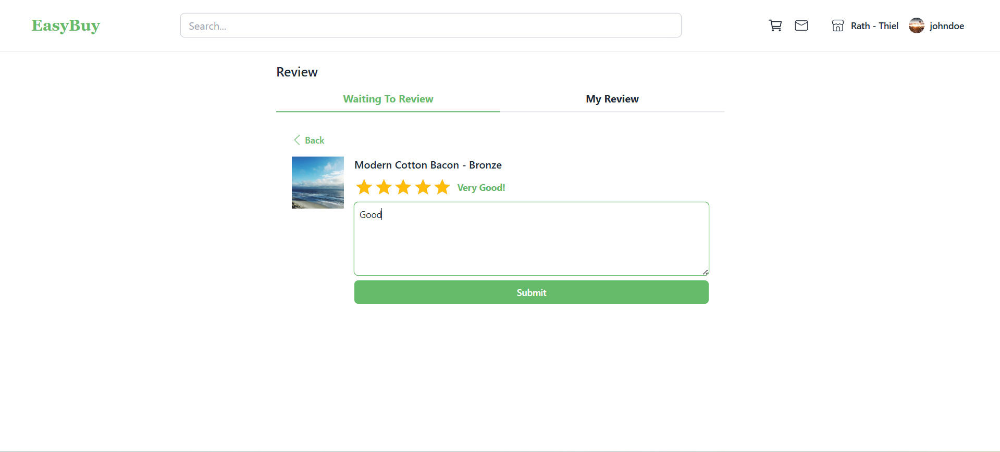

### Seller Pages

#### 🏪 Create Shop Page

- **Shop Registration**: Create a new seller shop
- **Shop Information**: Set up shop details and description

**Screenshot Placeholder:**

```
[Insert Create Shop Page Screenshot Here]
```

#### 📊 Product Management Page

- **Product List**: View all products in the seller's shop
- **Product Search**: Search and filter products
- **Product Actions**: Edit, delete, or manage product status
- **Product Statistics**: View product performance metrics

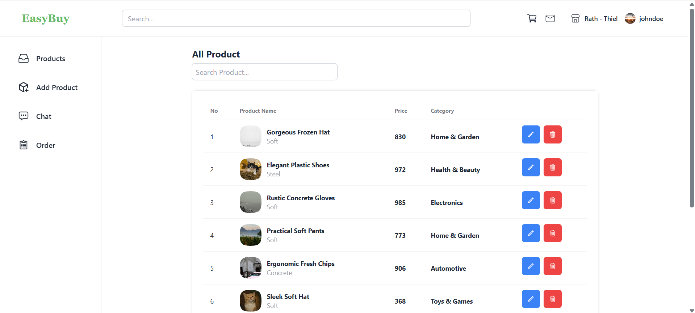

#### ➕ Add Product Page

- **Product Information Form**:
  - Product name and description
  - Category selection
  - Price and stock management
- **Product Variants**: Create and manage product variants (size, color, etc.)
- **Product Images**: Upload multiple product images
- **Product Details**: Configure detailed product specifications

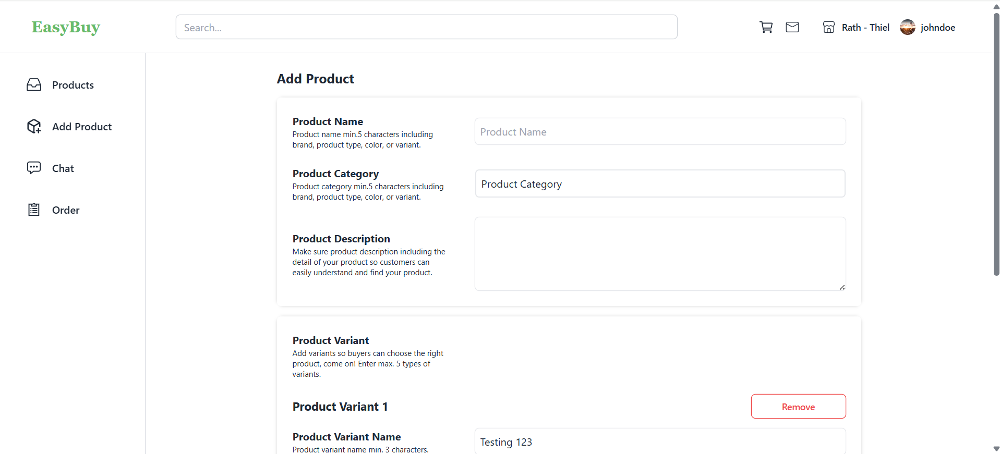

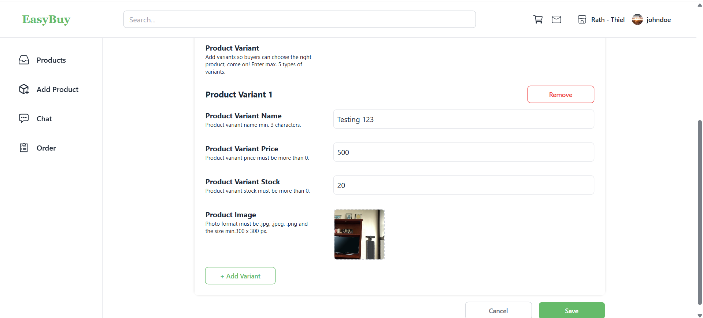

#### 📋 Order Management Page

- **Order List**: View all orders received
- **Order Status**: Track and update order status
- **Order Details**: View detailed order information
- **Customer Information**: Access customer details for each order

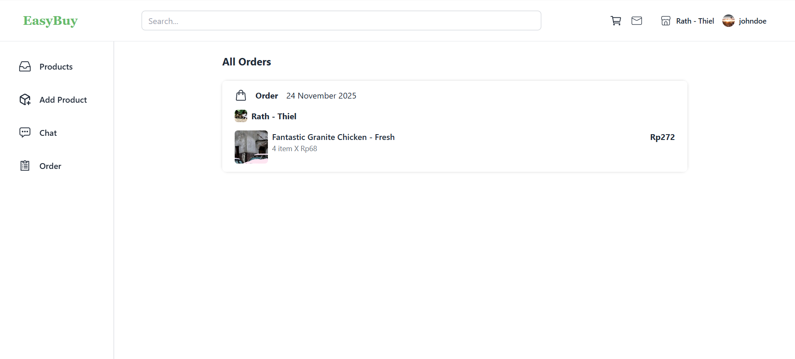

#### 💬 Seller Chat Page

- **Customer Conversations**: List of all customer chat conversations
- **Real-Time Messaging**: Respond to customer inquiries instantly
- **Order-Related Chats**: Manage chats related to specific orders

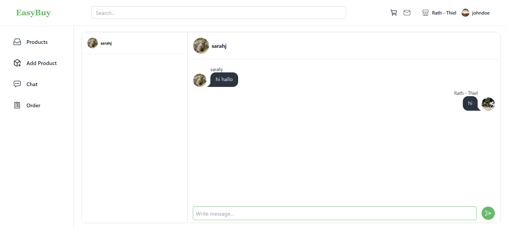

### Authentication Pages

#### 🔐 Login Page

- **User Authentication**: Secure login with email/username and password
- **Form Validation**: Input validation and error handling
- **Remember Me**: Optional session persistence

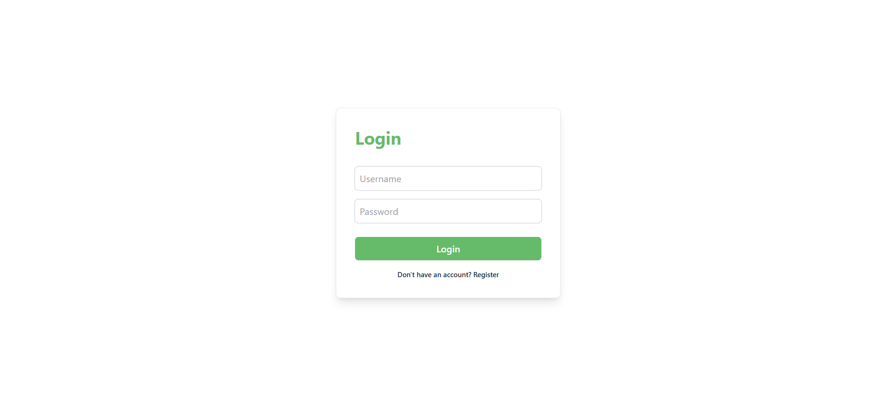

#### 📝 Register Page

- **User Registration**: Create new user accounts
- **Form Validation**: Comprehensive input validation
- **Account Creation**: Set up user profile during registration

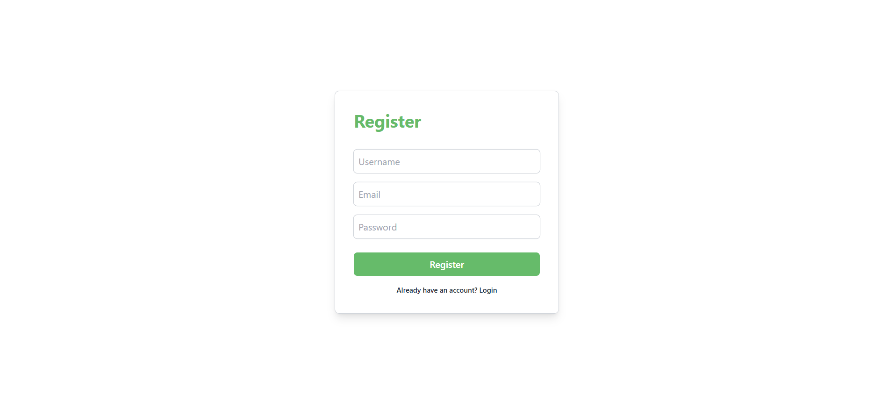

## 📱 Application Details

### Architecture

Easy Buy follows a modern React application architecture with:

- **Component-Based Structure**: Modular, reusable components
- **State Management**: Zustand for client-side state management
- **Data Fetching**: TanStack Query (React Query) for server state management
- **Routing**: React Router v6 with protected routes
- **Real-Time Features**: Socket.io for chat functionality

### Key Components

- **Layout Components**: Main layout with navbar and footer
- **Card Components**: Reusable card components for products, orders, reviews, etc.
- **Modal Components**: Address management modals
- **Form Components**: Product forms, review forms, etc.
- **UI Components**: Buttons, tabs, and other UI elements

### State Management

- **Zustand Stores**: Local state management for cart, chat, product details, etc.
- **React Query**: Server state management and caching
- **Context API**: Authentication context for user management

### API Integration

The application integrates with a RESTful backend API for:

- User authentication and authorization
- Product management
- Cart operations
- Order processing
- Chat functionality
- Review system
- Address management

### Security Features

- **Protected Routes**: Route guards for authenticated users
- **Seller Routes**: Special route protection for seller features
- **Guest Routes**: Redirect authenticated users away from login/register pages
- **Token-Based Authentication**: Secure API communication

## 🛠 Tech Stack

### Frontend Framework & Libraries

- **React 18.3.1**: UI library
- **TypeScript 5.2.2**: Type-safe JavaScript
- **Vite 5.3.1**: Build tool and development server

### Routing & State Management

- **React Router DOM 6.24.1**: Client-side routing
- **Zustand 4.5.4**: Lightweight state management
- **TanStack React Query 5.51.23**: Server state management and data fetching

### Styling

- **Tailwind CSS 3.4.4**: Utility-first CSS framework
- **DaisyUI 4.12.10**: Component library for Tailwind CSS
- **PostCSS 8.4.39**: CSS processing
- **Autoprefixer 10.4.19**: CSS vendor prefixing

### HTTP Client & Real-Time

- **Axios 1.7.2**: HTTP client for API requests
- **Socket.io Client 4.7.5**: Real-time bidirectional communication

### UI Components & Utilities

- **React Icons 5.2.1**: Icon library
- **React Hot Toast 2.4.1**: Toast notifications
- **React Simple Star Rating 5.1.7**: Star rating component
- **Swiper 11.1.9**: Touch slider/carousel

### Development Tools

- **ESLint 8.57.0**: Code linting
- **TypeScript ESLint**: TypeScript-specific linting rules
- **Prettier 3.3.3**: Code formatter
- **Prettier Plugin Tailwind CSS**: Tailwind class sorting

### Deployment

- **Docker**: Containerization
- **Nginx 1.27.4**: Web server for production
- **Node.js 22**: Runtime environment

## 🐳 Deployment with Docker

Easy Buy uses Docker for containerized deployment. The application is built with a multi-stage Dockerfile for optimal production builds.

### Dockerfile Structure

The Dockerfile uses a multi-stage build process:

1. **Build Stage**:

   - Uses `node:22-alpine` as base image
   - Installs dependencies
   - Builds the production-ready application
   - Creates environment variables file

2. **Production Stage**:
   - Uses `nginx:1.27.4` as base image
   - Copies built assets from build stage
   - Configures Nginx for serving the React SPA

### Docker Compose

The project includes `docker-compose.yml` for easy deployment:

```yaml
version: "3.8"
services:
  frontend:
    build: .
    image: frontend-web-easy-buy
    container_name: frontend-web-easy-buy
    ports:
      - "7654:3000"
    env_file:
      - .env
```

### Environment Variables

Create a `.env` file with the following variables:

```env
VITE_API_BASE_URL=your_api_base_url
VITE_SOCKET_URL=your_socket_url
VITE_NODE_ENV=production
```

### Building and Running with Docker

#### Using Docker Compose (Recommended)

```bash
# Build and start the container
docker-compose up -d --build

# View logs
docker-compose logs -f

# Stop the container
docker-compose down
```

#### Using Docker Commands

```bash
# Build the Docker image
docker build -t easy-buy-frontend .

# Run the container
docker run -d \
  -p 7654:80 \
  --name easy-buy-frontend \
  --env-file .env \
  easy-buy-frontend
```

### Production Deployment

For production deployment:

1. Set up environment variables in your deployment platform
2. Build the Docker image
3. Push to container registry (Docker Hub, AWS ECR, etc.)
4. Deploy to your hosting platform (Vercel, AWS, DigitalOcean, etc.)

The application will be served on port 80 inside the container (configurable via `PORT` environment variable).

## 💻 Running Locally

### Prerequisites

- **Node.js**: Version 18 or higher
- **npm**: Version 9 or higher (comes with Node.js)
- **Git**: For cloning the repository

### Installation Steps

1. **Clone the repository**

   ```bash
   git clone <repository-url>
   cd easy-buy-frontend
   ```

2. **Install dependencies**

   ```bash
   npm install
   ```

3. **Create environment file**

   Create a `.env` file in the root directory:

   ```env
   VITE_API_BASE_URL=http://localhost:3000/api
   VITE_SOCKET_URL=http://localhost:3000
   VITE_NODE_ENV=development
   ```

   Replace the URLs with your actual backend API and Socket.io server URLs.

4. **Start the development server**

   ```bash
   npm run dev
   ```

   The application will be available at `http://localhost:5173` (default Vite port).

5. **Build for production**

   ```bash
   npm run build
   ```

   The production build will be in the `dist` directory.

6. **Preview production build**
   ```bash
   npm run preview
   ```

### Available Scripts

- `npm run dev`: Start development server with hot module replacement
- `npm run build`: Build the application for production
- `npm run preview`: Preview the production build locally
- `npm run lint`: Run ESLint to check code quality

### Development Tips

- The app uses Vite's fast HMR (Hot Module Replacement) for instant updates
- Use React DevTools browser extension for debugging
- Check browser console for any errors or warnings
- Ensure your backend API is running and accessible

### Troubleshooting

**Port already in use:**

```bash
# Kill process on port 5173 (or change port in vite.config.ts)
npm run dev -- --port 3000
```

**Dependencies issues:**

```bash
# Clear node_modules and reinstall
rm -rf node_modules package-lock.json
npm install
```

**Build errors:**

- Ensure all TypeScript errors are resolved
- Check that all environment variables are set
- Verify that the backend API is accessible

---

**Built with ❤️ using React, TypeScript, and modern web technologies**
